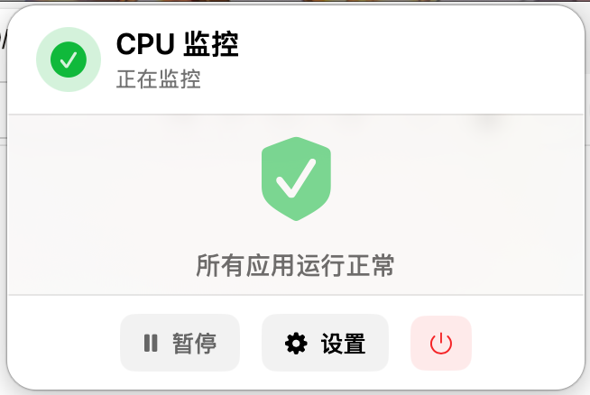
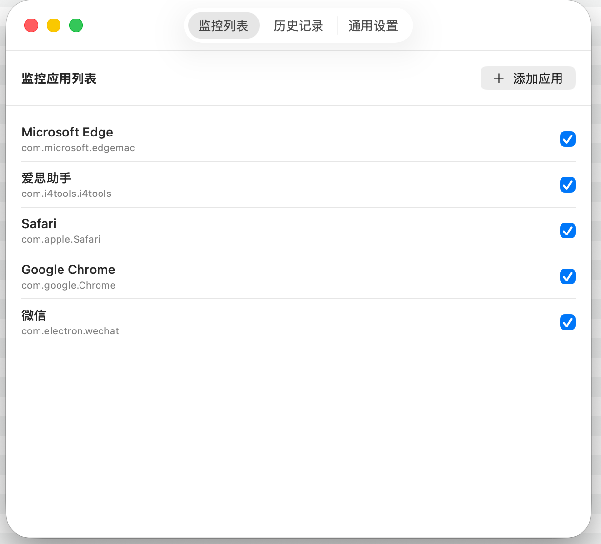

# CPU Monitor - macOS 进程监控工具

<p align="center">
  
</p>

<p align="center">
  <strong>智能检测后台应用 CPU 异常占用，及时提醒用户</strong>
</p>

<p align="center">
  <a href="#功能特性">功能特性</a> •
  <a href="#安装说明">安装说明</a> •
  <a href="#使用指南">使用指南</a> •
  <a href="#智能检测算法">智能检测算法</a> •
  <a href="#截图">截图</a>
</p>

---

## 📸 截图

<p align="center">
  
</p>
<p align="center">
  <em>菜单栏界面 - 所有应用运行正常</em>
</p>

<p align="center">
  
</p>
<p align="center">
  <em>设置窗口 - 监控列表和通用设置</em>
</p>

---

## 📋 功能特性

- 🔍 **智能进程监控** - 实时监控指定应用的 CPU 和内存使用情况
- 🧠 **智能异常检测** - 区分前台正常使用和后台异常占用，避免误报
- 🔔 **系统通知提醒** - 检测到异常时通过系统通知及时提醒
- 📊 **历史记录** - 记录所有异常事件和处理操作
- ⚙️ **自定义配置** - 支持自定义监控应用、CPU 阈值和检测时间
- 🚀 **开机自动启动** - 支持登录时自动启动监控
- 🎯 **白名单机制** - 可将特定应用加入白名单，避免重复提醒

## 💻 系统要求

- macOS 13.0 (Ventura) 或更高版本
- Apple Silicon 或 Intel 处理器

## 📦 安装说明

### 方式一：下载 DMG 安装包（推荐）

1. 前往 [Releases](https://github.com/Chris-440/macTool/releases) 页面下载最新版本的 `CPU-Monitor.dmg`
2. 双击打开 DMG 文件
3. 将 `CPU Monitor.app` 拖拽到 `Applications` 文件夹
4. 从启动台或应用程序文件夹启动应用

### 方式二：从源码构建

```bash
# 克隆仓库
git clone https://github.com/Chris-440/macTool.git
cd macTool

# 使用 Xcode 构建
xcodebuild -project macTool.xcodeproj -scheme macTool -configuration Release

# 构建完成后，应用位于：
# build/Release/macTool.app
```

## 🚀 使用指南

### 首次启动

1. 启动应用后，你会在菜单栏看到 CPU Monitor 的图标
2. 点击图标可以查看当前监控状态
3. 应用默认监控以下应用：
   - Microsoft Edge
   - 爱思助手
   - Safari
   - Google Chrome
   - 微信

### 设置监控列表

1. 点击菜单栏图标 → 设置
2. 切换到"监控列表"标签页
3. 点击"添加应用"添加需要监控的应用
4. 可以设置每个应用的 CPU 阈值和检测时间

### 处理异常提醒

当检测到应用 CPU 异常占用时，你会收到系统通知。点击菜单栏图标可以：

- **退出应用** - 立即终止异常应用
- **忽略** - 忽略本次提醒
- **白名单** - 将该应用加入白名单，不再提醒

## 🧠 智能检测算法

CPU Monitor 采用智能算法，避免误报：

### 检测策略

1. **前台活跃应用**
   - 用户使用中的应用使用更高阈值（默认阈值的 2.5 倍）
   - 只有当 CPU 极高（>75%）且持续 60 秒以上才提醒

2. **后台应用**（主要检测场景）
   - 后台应用 CPU 超过阈值（默认 30%）
   - 持续一定时间（默认 30 秒）后触发提醒
   - 分析 CPU 趋势：上升/稳定/下降

3. **前台非活跃应用**
   - 应用在前台但用户未交互
   - 使用中等阈值（默认阈值的 1.5 倍）

### 防频繁提醒

- 同一应用 5 分钟内只提醒一次
- 可手动将应用加入白名单

## ⚙️ 配置说明

### 默认监控配置

| 应用 | CPU 阈值 | 后台持续时间 |
|------|---------|-------------|
| Microsoft Edge | 30% | 30秒 |
| 爱思助手 | 25% | 30秒 |
| Safari | 35% | 30秒 |
| Google Chrome | 30% | 30秒 |
| 微信 | 20% | 30秒 |

### 自定义配置

在设置中可以自定义：
- **CPU 阈值** - 触发提醒的 CPU 占用百分比
- **后台持续时间** - CPU 超过阈值需要持续的秒数
- **白名单** - 标记为白名单的应用不会被提醒

## 🔒 隐私说明

- 本应用仅在本地监控进程信息，不会上传任何数据
- 需要获取进程信息权限以读取 CPU 和内存使用情况

## 🛠️ 技术栈

- **语言**: Swift 5
- **框架**: SwiftUI, AppKit
- **最低系统版本**: macOS 13.0

## 🤝 贡献

欢迎提交 Issue 和 Pull Request！

## 📄 许可证

本项目采用 MIT 许可证 - 详见 [LICENSE](LICENSE) 文件

## 🙏 致谢

感谢所有贡献者和用户的支持！

---

<p align="center">
  Made with ❤️ by dzj
</p>